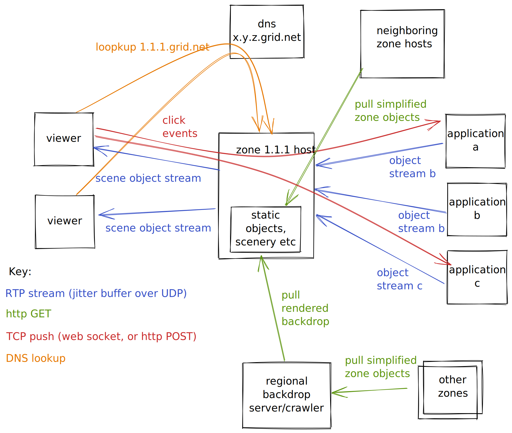
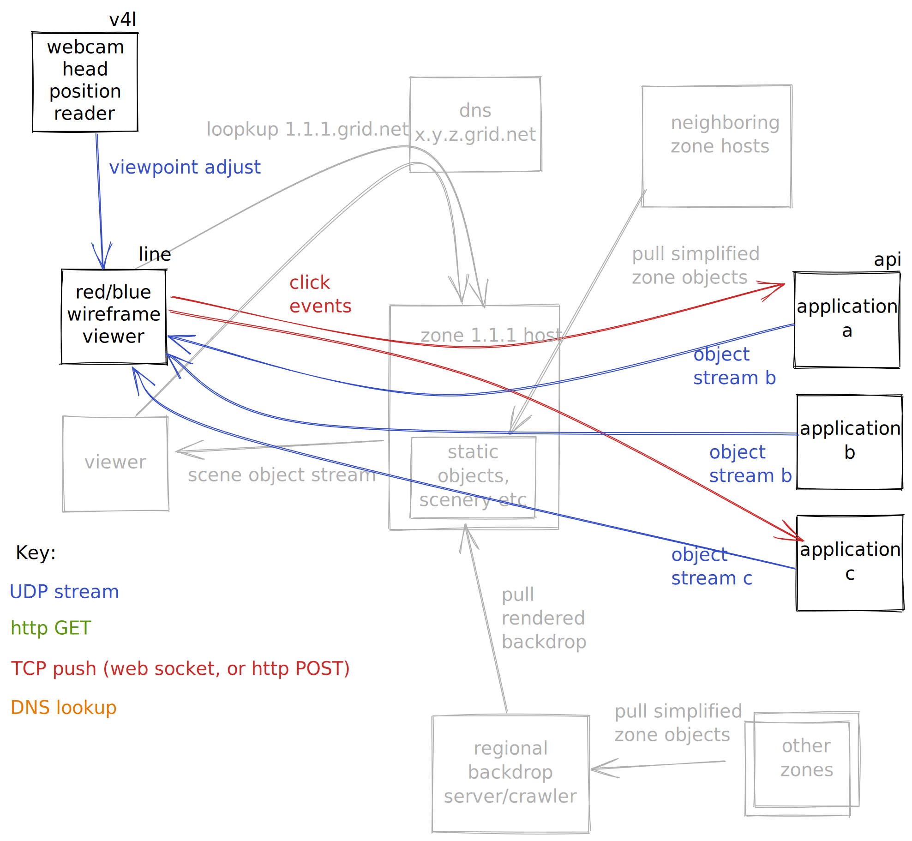

# darkbat

display adapter for global application desktop


## architecture



# what's actaully implemented here



# compiling for mac

- install xquartz
- create a symbolic link from /usr/local/include/X11 to /opt/X11/include/X11

# Viewer

```
$ cd viewer
$ make
$ ./view
```

## keys
- h left
- j back
- k forward
- l right
- u up
- , down
- \- zoom out
- \= zoom in

Clicking on something clickable highlights it, keypresses that are not the viewer keys are sent to the
client application that owns the highlighted item.

# demo client

These are a ui for a bank of volume control sliders.  They project to an adjustable position, a bit
behind the starting viewpoint of the view.

## keys

- 1 slider down
- 2 slider up

## compilation

```
$ cd api
$ make
```

## example

- start the viewer
- move the view back a bit
- in a 2nd shell, make a volume panel: $ ./dkbtest
- in a 3rd shell, make another next to it: $ ./dkbtest 20
- the triangles are the handles, click on a triangle and 1 and 2 will adjust the sliders

